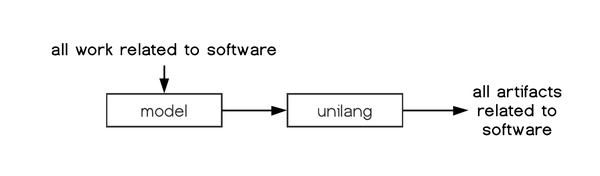
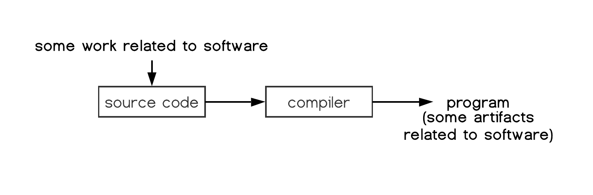
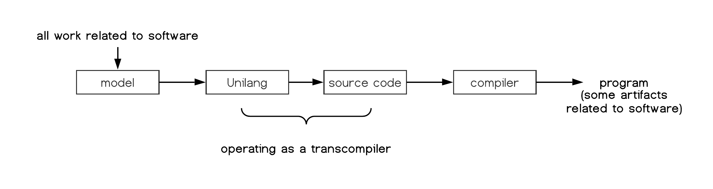
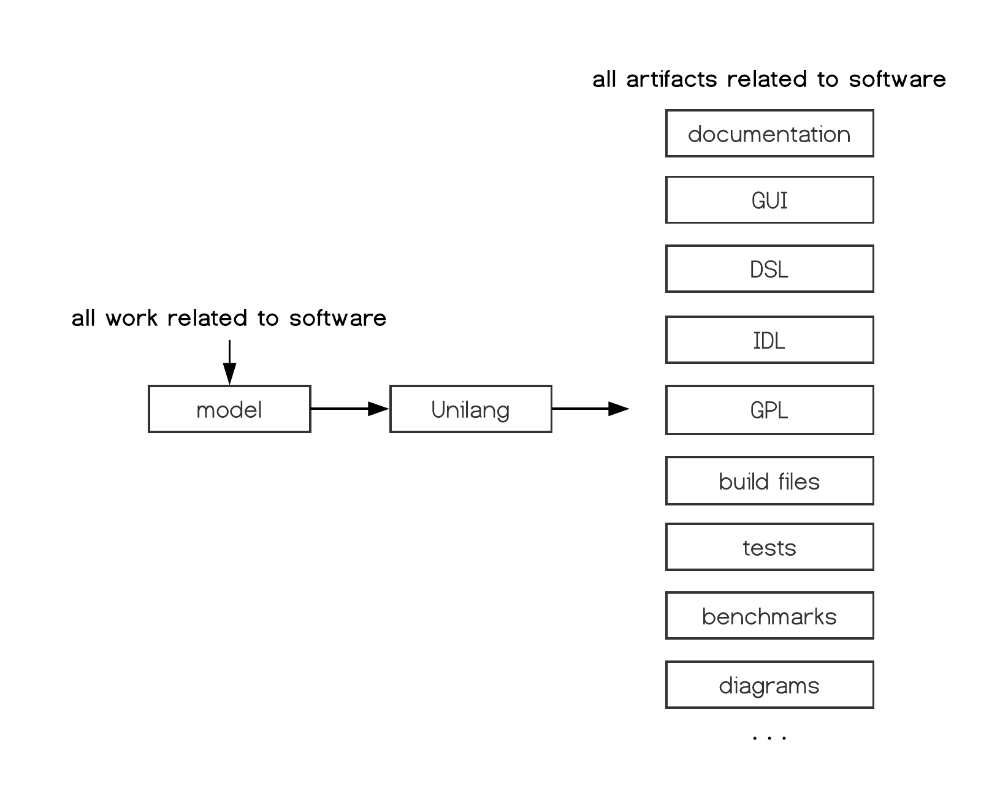
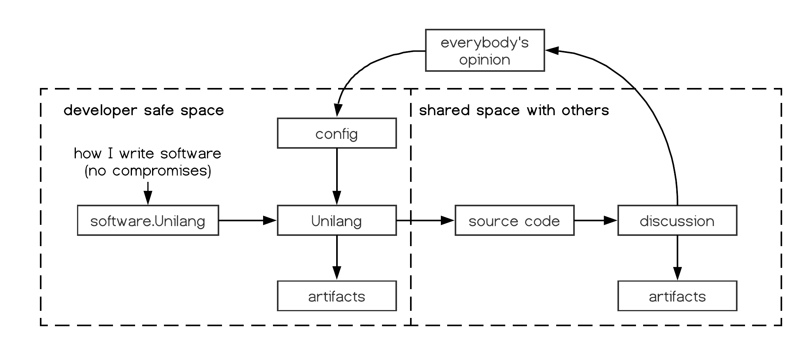
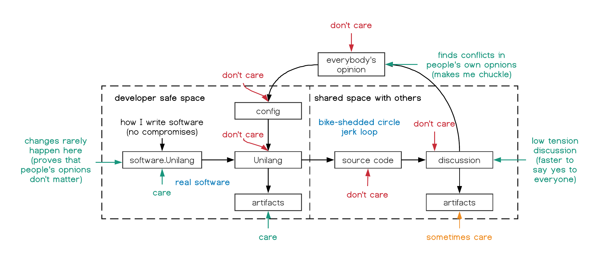
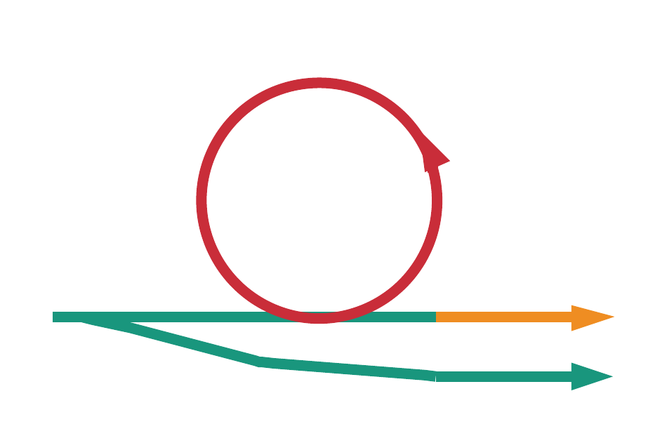

 [](https://www.dropbox.com/s/1qde65ekii8nyb9/unilang.pdf?dl=1)
**A universal programming language**


</details>
<details>

<summary>Introduction</summary>


## GPLs Fall Short
Despite their name, **general-purpose programming languages (GPLs)** have become commonly associated with specific niches across different programming domains.  Due to the differences between these languages (both internal and external to their design), evaluations of the problem space lead to different languages being chosen.  A cross-domain problem is commonly solved through a mixture of languages.  Under such circumstances, individual GPLs have not proven general enough as the solution to the entire problem space.  Unilang's stance is that the amalgamation of different languages could be an implementation detail below a more conceptually pure representation of the full problem ontology.  We consider different languages within the same ontology to be less productive for establishing insight and enabling change over time.  It is better to have the entire problem space of software encoded from the same unifying model.  A unifying language can operate as a transcompiler to other existing GPLs.  


## The Next Layer
Unilang is a **universal programming language (UPL)**.  A UPL has not been formally defined prior to the creation of this document.  As an informal definition, envision a UPL as a language abstraction over GPLs.  UPLs are a universal encoding for developing software.  


## Skepticism
Creating a language that could properly be the right choice for every programming domain sounds impractical.  Domains can have opposite requirements.  Trying to encode everything necessary for all domains would result in something so complicated, contradictory, and convoluted that it would defeat the purpose it set out to accomplish.  It would become too difficult to use in any domain.  These concerns are critically important, and we acknowledge them here as they have been influential in Unilang's design and development.  If Unilang were designed in the traditional way that GPLs are, we would certainly hit many of these problems.  We instead take different approaches toward a language's role in facilitating software.  Unilang is an experiment to challenge these concerns and to try and innovate ways around them.  We will address the particular issues later.  For now, we simply acknowledge the ambition and scope of the project.  


## A Wider Net
A primary focus when first introducing Unilang is a discussion around **encoded information** and **software-related artifacts**.  What do we encode for software and what are the resulting software artifacts?  We discuss what engineers need to encode while working in a problem domain, and what products should come from such an encoding.  A conclusion is made that engineers are not encoding everything necessary due to the limitations, scope, and enforced structure of individual tools.  Additionally, the effect of not having a universal encoding results in multiple encodings across different languages which makes maintenance less feasible over time.  An argument is made that more concepts related to software must be semantically encoded at the language level.  The technical aspects of making this feasible are discussed later.  We will compare it to other programming languages to show the similarities and key differences between them.  The key take-away from this comparison is that Unilang is not competing with other programming languages.  It embraces all of them in its own implementation.  By supporting more and more languages as an output, unilang can extract out paradigms and concepts universal to programing, and prove its genericness through other language toolchains.  


## Full Scope
Let's start by getting you acquainted with the big picture.  Unilang is a tool for writing software.  And like all tools in software, it takes an input and produces an output.  The scope of Unilang's throughput however is ambitious.  Everything a software engineer can express around a problem domain must be encoded in the same ontology.  We find this necessary in maximizing our current understanding of the problem domain, and adapting to its change over time.  The output of this ontology is every chosen artifact that facilitates desired tasks in that domain.  From a programming perspective, we unify all formal and informal languages involved around software.  This information is then encoded as a single abstract data model which is used to create various artifacts.  


The diagram above is intentionally vague.  However, we can use it to compare the transformation process of source code in other programing languages.  The scope of these other languages do not entail all of the work that needs to be done in a real-world software engineering context.  


The goals of general purpose programming languages (GPLs) shown above, are also realized within Unilang.  Unilang can be used to generate programs for any domain.  A key feature of Unilang is that it can even target the source code of all other GPLs.  This means that Unilang can be easily adopted in current systems as a transcompiler to other programming languages.  


There are many other types of artifacts that should be created alongside software.  Unilang facilitates the creation of these artifacts as well.  


In fact, what you are reading now was generated from Unilang.  


## Motivation
The motivation behind Unilang has grown organically while working as a software engineer.  It serves a purpose both practical and personal while working in the industry.  Some of it has been designed to help within a professional context.  Other parts have been designed around the personal/hobby context.  In this section we will cover the specific motivations around Unilang.  


### Practical
TODO.  


#### File Flexibility
Unilang avoids having to create multiple files if undesirable.  Its customizable in the granularity of files it produces.  N number of unilang files may create a single artifact file.  A single unilang file might also create hundreds of artifact files.  These decisions are highly customizable and can be dependent on file contents.  


#### Code Bloat
Many GPLs accrue areas where ideas need repeated.  Decelerations and definitions may need repeated signatures.  Documentation may need to repeat names above the names being documented.  Unit may tests need to repeat the unit being tested.  Unilang avoids code bloat by not needing things repeated.  


#### Concept Locality
Unilang allows you to describe information local to the data and functions they belong to.  For example, unit tests, benchmarks, examples, constraint specifications, and documentation can all be specified right next to the data / functions they are operating on.  This makes maintenance easier, and improves static analysis given the associated context.  As an analogy, I'd like you consider the same phenomenon that has already happened in web development.  HTML, CSS, and JavaScript had been traditionally grouped separately in the implementation of web applications.  It seems logical to keep semantic markup, styling, and functionality disjoint as a means of low coupling (an engineering discipline where we don't want to conflate different things together).  However, it was only later that the engineering community realized that this was actually a matter of high cohesion where the three languages need unified to create a particular component.  


### Personal
Sometimes it is frustrating working with other people.  Quite often others will advocate misguided opinions that slow me down and lead to worse software.  Compromising with and teaching others is a social undertaking that wastes a lot of my time and can often lead to higher tension.  I have found it better to write software correctly without compromise, and then transform it into a shared development space.  This lets me keep my integrity as an engineer and not break any of my engineering values while still working with others.  This process also helps me get along with other people because they think they are helping, even though my true interests are not in anything they contribute to.  


We attribute labels on which parts of the development cycle we care about.  This reveals a "don't care" cycle which we use unilang to optimize the speed of iteration.  The improved iteration speed of the "don't care" cycle also helps unilang grow to be more conceptually pure, and applicable in more domains.  What we do care about remains streamlined and isolated from other people.  


This shows that even if the project being worked on is meaningless, we measure our success from a personal space outside.  Summarized this shows us that Unilang supplies a fork that we can care about, and a less desired public-facing path that we can indirectly contribute to through automation.  



## Till The End
Unilang may never be finished.  Like many projects it will simply grow closer toward the ideals it has set before itself.  Since unilang is intended to be used for all facets of software engineering, we embrace the large scope of the project.  Scope creep is only detrimental if you intend to finish something completely.  Unilang will grow organically to meet the needs of software engineering and along the way, we will develop, record, and maintain features and capabilities provided by the language.  

</details>
<details>

<summary>Language Design</summary>

In this section, we will discuss the theory of what a programming language should be.  We show how these ideas are applied in shaping the design of Unilang.  


## Hierarchy
In this section we discuss the hierarchy of language.  Consider the current language abstractions within the software engineering domain.  Unilang and its conceptual model are placed above these high level languages.  


Unilang can transcompile down to other languages.  


## Structure
In this section we discuss the structure of language.  Many programming languages represent their syntactic structure as an abstract syntax tree.  Other languages like Lisp and its derivations choose nested lists.  The structure of Unilang is a composed set of algebraic data types.  


This is a subtle but important distinction.  An ADT models the concise structure and shape of programming concepts.  This allows us to work backwards and enable programmers to efficiently populate this structure.  Trying to contort a variety of programming concepts syntactically, and then extracting them out with regular expressions and grammars into generic data structures such as trees and lists has proven insufficient for semantic analysis.  Its the reason that parsing errors are often confusing and unhelpful.  Its the reason that community tooling on code transformation is often limited.  Most importantly, its the reason a language's evolution tends to stagnate as more abstract concepts are squeezed into an existing syntax and grammar.  


## Ergonomics
In this section we discuss the ergonomics of the language in terms of reading and writing.  TODO. this is where we talk about discrete infinity.  TODO. this is where we talk about projectional editors.  


## Guiding Principles


### Syntax
Syntax doesn't matter. It never has, and it never will.  We eliminate syntax complexity through unique symbolic tokens.  Unilang pulls from Unicode's Private Use Area (PUA).  As a result, no matter how many tokens get added the the language, the lexical and syntactical analysis remains trivial.  Unilang comes with its own font, but users can choose their own glyphs to represent individual code points.  Although Unilang could equally be represented in a markup format such as json or yaml, we provide the unicode textual frontend as it tends to look simpler, allow for custom glyphs, and is easy to colorize in editors.  User's can choose to write directly in this unicode format, or use the graphical system built on top of it.  


### Grammar
You can express anything in any order assuming that it makes sense conceptually.  Semantic analysis builds an ADT nearly identical to the tokens you write.  You can leave many token out, and based on various configurations, you will get default values, automated enrichments, or descriptive errors.  So many languages have bad compiler errors.  You will not find this in Unilang due to the rich token set and easy to understand grammar.  


### Code Generation
Unilang could target LLVM, output byte code for the JVM, or operate under its own interpreter.  However, there is little reason to invest in these efforts at this time.  We stand on the shoulder's of giants and transcompile to other languages.  This is a strategic decision because it helps Unilang grow in 2 ways.  The more languages Unilang can transcompile to other languages, the more we can generalize programming concepts across the ecosystem.  It also helps us show that two seemingly apposing language design decisions can be incorporated into the same language and chosen programatically at build time.  


### Supersets
Many people believe a language should have a strong and simple core.  This is followed by the advice of having libraries do the rest of the heavy lifting.  This stems from the experience of how difficult it becomes to change a language once so much code is written in it.  Unilang puts as much in the language as possible, because anything that is added must be a concept that stands independent of the code that is generated.  Extending Unilang with new tokens is backwards-compatible, and doesn't affect the existing grammar.  Although Unilang may have a large number of language tokens to account for all these concepts, it is not very overwhelming because the majority of them are not required.  


### Steal
Unilang is not afraid to steal all the good ideas from other languages.  Through its design, it avoids all of the pitfalls that current languages accrue when adding too many features.  


### No trade-offs
Typical programming languages are designed around trade-offs.  Unilang refuses to make trade-offs.  Most opinions can be dual supported at the language level, and chosen during code generation.  

</details>
<details>

<summary>Features</summary>

TODO. also consider a language matrix of tests/features that we have working across languages.  


## IDL support
TODO.  


## GPL support
TODO.  


## DSL support
TODO.  

</details>
<details>

<summary>User Guide</summary>

Here we talk about how to use Unilang.  


## Installation
Ready to get started?  Unilang can be built from source in the following way.  
```
git clone git@github.com:Unilang/unilang.git unilang
cd unilang
./build_everything
```
Various CIs are also building from source and can be used as reference.  

| Continuous Integration | Status | Notes | 
| --- | --- | --- | 
| App Veyor | [](https://ci.appveyor.com/project/luxe/everything/branch/master) | Full Build | 
Circle | [](https://circleci.com/gh/Unilang/unilang) | Bootstraps Build | 
Cirrus | [](https://cirrus-ci.com/github/Unilang/unilang) | Bootstraps Build | 
Codeship | [](https://app.codeship.com/projects/9bd37ae0-f384-0136-68bc-72341457e248/) | Full Build | 
Scrutinizer | [](https://scrutinizer-ci.com/g/unilang/unilang/build-status/master) | Full Build | 
Semaphore | [](https://semaphoreci.com/luxe/unilang) | Full Build | 
Shippable | [](https://app.shippable.com/accounts/5c3163cad1578b0700302159/dashboard) | Full Build | 
Travis | [](https://travis-ci.com/Unilang/unilang) | Full Build | 


## Textual Frontend


### YAML
Unilang code can be stored in YAML format and changed directly.  


#### JSON
Unilang code can be stored in JSON format and changed directly.  


## Graphical Frontend
Unilang has its own graphical IDE which makes working in the language easier.  This is the recommended way of using Unilang.  


## Bazel Rule Examples


## Tutorials
These are learning-oriented tutorials to get you antiquated with concepts.  


## How To Guides
These are goal-oriented to show you how to solve particular problems.  


## Explanations
These are understanding-oriented to provide you with background and context.  


## Reference
These is information-oriented to provide you with complete and accurate details.  

</details>
<details>

<summary>Developer Guide</summary>

TODO. here we talk about information for anyone who wants to contribute to the Unilang project.  


## Build System
TODO.  


### Hermetics
The project is designed to be hermetic.  This means that all external dependencies should be bootstrapped by the build system and self-contained within the repository.  If anything in the build relies on an external dependency (not available or tracked by the repository) this can break user's builds, and it is a bug.  Here is an overview on what the build system looks like.  


## Contribute
There are no rules.  Make a ticket about anything.  We'll figure it out together.  

