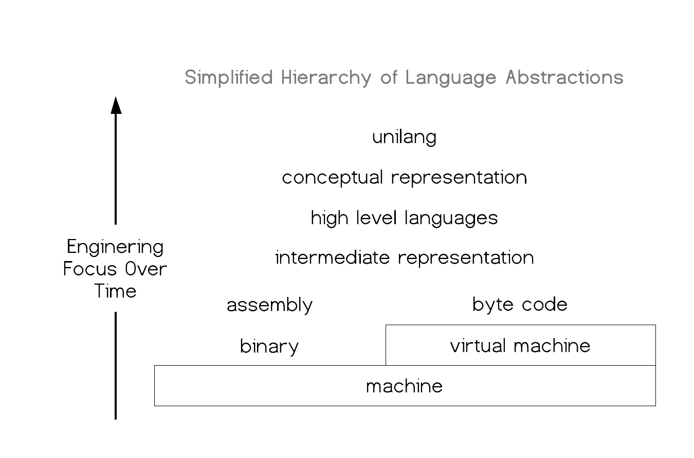
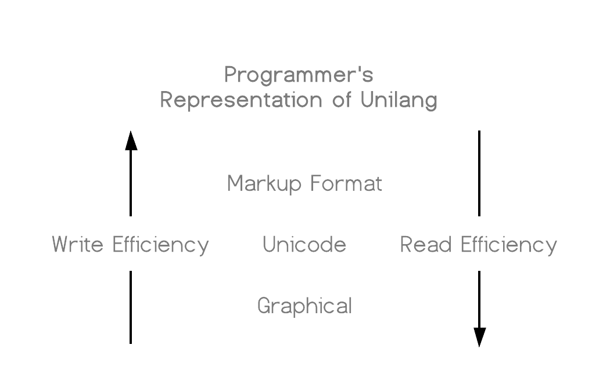

# ᴜɴɪʟᴀɴɢ

Unilang is a universal programming language.  
It is the unification of all programming concepts without syntax.  
It is a higher level language above all high level languages.  
It was built to improve the efficiency of the modern software engineer.  

## The hierarchy of language
Consider the current language abstractions within the software engineering domain.  
Unilang and its conceptual model are placed above these high level languages.  
  

## The structure of language
Many programming languages represent their syntatic structure as an abstract syntax tree.  
Other languages like Lisp and its derivations choose nested lists.  
The structure of unilang is a composed set of algebraic data types.  
This is a subtle but important distinction.  
An ADT models the concise structure and shape of programming concepts.    
This allows us to work backwards and enable programmers to effeciently populate this structure.  
Trying to contort a variety of programming concepts syntatically, and then extracting them out with regular expressions and grammars into generic data structures such as trees and lists has proven insufficient for semantic analysis.  
This is the reason that parsing errors are often confusing and unhelpful.  


## Direct semantic encoding (syntax considered harmful)
TODO.  
essentially end at a markup language.  
markup language is great from the compilers perspective,
but terrible from the programmers perspective.  
Explain how we fix this.  
Discuss Linguistic relativity, the universal grammar, and maybe the poverty of stimulous.  
uh, we'll probably need a deeper section about natural language vs programming language.  
what is relevant, what is not. how properties of natural language has incorrectly been applied in programming

## Guiding Principles
All of these need adjusted and organized

#### 1.  Syntax
Syntax doesn't matter.  It never has, and it never will.    
We eliminate syntax complexity through unique symbolic tokens.  
Unilang pulls from [Unicode's Private Use Area (PUA)][1].  
As a result, no matter how many tokens get added the the language,  
the lexical and syntatical analysis remains trivial.  

Unilang comes with its own font,  
but users can choose their own glyphs to represent individual [code points][2].  
Although Unilang could equally be represented in a markup format such as json or yaml,   
we provide the unicode textual frontend as it tends to look simpler,   
allow for custom glyphs, and is easy to colorize in editors.  
User's can choose to write directly in this unicode format,  
or use the graphical system built on top of it.  


The first point of contention people have with the language,  
is that they cannot fire of vim and start writing in it.  
In its ascii markup format, Unilang is too dense.  
It's dense, because we don't play any games with syntax or gramar in an attempt to make it more paletable.  
We want the user to be encoding concepts as close to the Unilang conceptual ADT as possible.  
Programming in unicode has proven to be a good trade-off between readability and writeability.  
I urge you to remember, that software enginering requires a lot more reading than it does writing.  

**Design choice:**  
Code is data.  We intend to make the language as close to a data structure as possible.  
Without making yet another lisp-like language, and have you drowning in parenthesis, we  
chose to target a conceptual ADT utilizing nested variants.  It's richer than an AST, or having everything as a list.  

#### 2. Grammar
You can express anything in any order assuming that it makes sense conceptually.  
Semantic analysis builds an ADT nearly identical to the tokens you write.  
You can leave many token out, and based on various configurations,  
you will get default values, automated enrichments, or descriptive errors.  
So many languages have bad compiler errors.  You will not see these in Unilang  
due to the rich token set and easy to understand grammar.  

**Design choice:**  
We are already set on using unique tokens for 1-1 mappings on the conceptual ADT.  
It is trivial to parse these indepent tokens in any order so why enforce it.  
If user's want consistency, unilang can simply tidy itself to a particular user chosen order.  


#### 3. Code generation
Unilang could target LLVM, output byte code for the JVM, or operate under its own interpreter.  
However, there is little reason to invest in these efforts at this time.  
We stand on the shoulder's of giants and transcompile to other languages.  
This is a strategic decision because it helps Unilang grow in 2 ways.  
The more languages Unilang can transcompile to other languages,   
the more we can generisize programming concepts across the ecosystem.  
It also helps us proof that two seemingly apposing language design decisions  
can be incorperated into the same language and chosen programatically at build time.

**Design choice:**  
This was an easy decision.  For Unilang to grow in a conceptually pure way,  
we measure our success by our ability to transcompile to other languages.  
It's also less work for the backend, and it lets us secretly and immediately use Unilang in industrial cirumstances.  
We get real situations where Unilang is being used, and user's are unaware that they  
are contributing to its success by commenting on the transcompiled format.  
We can usually meet the needs of other programmers reading the transcompiled version  
of Unilang by putting their opinions into the configuration of the backend transcompiler.  

#### 4. Supersets Win
Many people believe a language should have a strong and simple core,  
followed by the advice to have libraries do the rest of the heavy lifting.  
This stems from the experience of how difficult it becomes to change a language
once so much code has been written in it.   
Unilang puts as much in the language as possible, because anything that is added must be
a concept that stands independent of the code that is generated.  
Extending unilang with new tokens in a backwards-compadible, and doesn't affect the existing grammar.

**Design choice:**  
The more context a compiler has, the more it can do.  
It can generate better code, give better error messages,  
and improve static analysis.

#### 5. Steal
Unilang is not afraid to steal all the good ideas from other languages.  
Through its design, it avoids all of the pitfalls that current languages acrue when adding too many features.  

#### 6. No trade-offs
Typical programming languages are designed around trade-offs.  
Unilang refuses to make trade-offs.   
Most opinions can be dual supported at the language level,  
and chosen during code generation.

## Installation
#### Build from source
```
git clone git@github.com:Unilang/everything.git unilang;
cd unilang/source;
bazel build --cxxopt='--std=c++17' //...:all;
pray
leave me a ticket about how it didn't work, and we'll improve the build
```

#### stand-alone binaries
TODO

[1]: https://en.wikipedia.org/wiki/Private_Use_Areas
[2]: https://en.wikipedia.org/wiki/Code_point

## Contribute
There are no rules.  Make a ticket about anything.  We'll figure it out together.  
