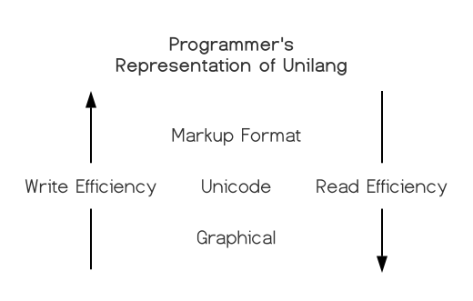

# ᴜɴɪʟᴀɴɢ
Unilang is a universal programming language.  
It is the unification of programming concepts without syntax.  
It is a higher level language above all high level languages.   
It was built to improve the efficiency of the modern software engineer.    

## Guiding Principles

#### 1.  Syntax
Syntax doesn't matter.  It never has, and it never will.    
We eliminate syntax complexity through unique symbolic tokens.  
Unilang pulls from [Unicode's Private Use Area (PUA)][1].  
And as a result, no matter how many tokens get added the the language,  
the lexical and syntatical analysis remains trivial.  

Unilang comes with its own font,  
but users can choose their own glyphs to represent individual [code points][2].  
Although unilang could equally be represented in a markup format such as json or yaml,   
we provide the unicode textual frontend as it tends to look simpler,   
allow for custom glyphs, and is easy to colorize in editors.  
User's can choose to write directly in this unicode format, or use the graphical system built on top of it.


#### 2. Grammar
You can express anything in any order assuming that it makes sense conceptually.  
Semantic analysis builds an ADT nearly identical to the tokens you write.

#### 3. Code generation
Unilang could target LLVM, output byte code for the JVM, or operate under its own interpreter.  
However, there is little reason to invest in these efforts at this time.  
We stand on the shoulder's of giants and transcompile to other languages.

#### 4. Supersets Win
TODO

#### 5. Steal
TODO

#### 6. No trade-offs
Typical programming languages are designed around trade-offs.  
Unilang refuses to make trade-offs.   
Most opinions can be dual supported at the language level,  
and chosen during code generation.

## Installation
#### Build from source
```
git clone git@github.com:Unilang/everything.git unilang;
cd unilang/source;
bazel build --cxxopt='--std=c++17' //...:all;
pray
leave me a ticket about how it didn't work, and we'll improve the build
```

#### stand-alone biaries
TODO

[1]: https://en.wikipedia.org/wiki/Private_Use_Areas
[2]: https://en.wikipedia.org/wiki/Code_point

## Contribute
There are no rules.  Make a ticket about anything.  We'll figure it out together.  
