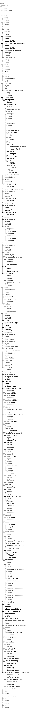

 [](https://www.dropbox.com/s/1qde65ekii8nyb9/unilang.pdf?dl=1)

**A universal programming language**


</details>
<details>

<summary>Introduction</summary>


## Summary
Unilang is a programming language and IDE.  It has a graphical and textual fronted for creating programs.  The language unifies with other languages through transcompilation.  It was written to automate and improve the productivity of a single person, but you might find something useful in it as well.  


## Design
The creation of this language is different from most other programing languages because it rejects the idea of traditional lexical analysis and language grammars.  Programming in Unilang becomes re-focus on encoding concept values to the language's meta-model.  This avoids the typical transformation process where syntactical expressions are parsed into ASTs; a strategy that seems to lose the pragmatic meaning from the originally intended encoded information.  An example of this issue can be more widely seen if we reflect on the usefulness of compiler errors.  A large amount of effort has gone into trying to make error messages as clear as possible, but often times there still remains a clarity gap that could be filled.  By any means, why should the programmer be capable of making syntactical mistakes in the first place?  Projectional editing can solve this.  A longer description for the rationale around Unilang's design is covered in the remaining subsections.  


## GPL Shortcomings
Despite their name, **general-purpose programming languages (GPLs)** become associated with specific niches that target particular programming domains.  Due to the differences between these languages (both internal and external to their design), evaluations on the problem space lead to different languages being chosen.  A cross-domain problem is then solved through a mixture of languages.  Under such circumstances, individual GPLs have not proven general enough as the solution to the entire problem space.  Unilang's stance is that the amalgamation of different languages could be an implementation detail below a more conceptually pure representation of the full problem ontology.  We consider different languages within the same ontology to be less productive for establishing insight and enabling change over time.  It is better to have the entire problem space of software encoded from the same unifying model.  A unifying language can operate as a transcompiler to other existing GPLs.  


## The Next Layer
Unilang is a **universal programming language (UPL)**.  A UPL has not been formally defined prior to this document, but as an informal definition, envision a UPL as a language abstraction over GPLs and IDLs.  UPLs are a universal encoding for developing software.  


## Addressing Scope
Creating a language that could properly be the right choice for every programming domain sounds impractical.  Domains can have opposite requirements.  Trying to encode everything necessary for all domains would result in something so complicated, contradictory, and convoluted that it would defeat the purpose it set out to accomplish.  It would become too difficult to use in any domain.  These concerns are valid, and maybe even inevitable. We acknowledge them here as they have been influential in Unilang's design.  If Unilang were built in the traditional way that GPLs are, we would certainly hit many of these problems.  We instead take different approaches toward a language's role in facilitating software development.  Unilang is an experiment to challenge these concerns and to try and innovate ways around them.  

</details>
<details>

<summary>Development</summary>


## Build
The IDE can be used the following way.  
```
git clone git@github.com:luxe/unilang.git
cd unilang
./user_run_optimized //code/tools/ide:main
```
Various CIs are used to test the correctness of the build.  Referencing these builds may help you acquire any additional dependencies.  The reason we use multiple CIs is to ensure a general consensus and catch any outlying issues.  However, these services have limitations at their free tier, and so full builds/tests are not performed.  

| Continuous Integration | Status | Notes | 
| --- | --- | --- | 
| App Veyor | [](https://ci.appveyor.com/project/luxe/unilang) | Bootstraps Build | 
Circle | [](https://circleci.com/gh/luxe/unilang) | Bootstraps Build | 
Cirrus | [](https://cirrus-ci.com/github/luxe/unilang) | Bootstraps Build | 
Codeship | [](https://app.codeship.com/projects/87336dd0-50a7-0137-d1ab-4a6287d94fd4/) | Bootstraps Build | 
Drone | [](https://cloud.drone.io/luxe/unilang) | Bootstraps Build | 
Scrutinizer | [](https://scrutinizer-ci.com/g/luxe/unilang/build-status/master) | Bootstraps Build | 
Semaphore | [](https://semaphoreci.com/luxe/unilang) | Bootstraps Build | 
Shippable | [](https://app.shippable.com/accounts/5c3163cad1578b0700302159/dashboard) | Bootstraps Build | 
Travis | [](https://travis-ci.com/luxe/unilang) | Bootstraps Build | 

The unilang schema is used to encode the concept tree and can be enforceable during projectional editing.  



## Contribute
There are no rules.  Make a ticket about anything.  We'll figure it out together.  


